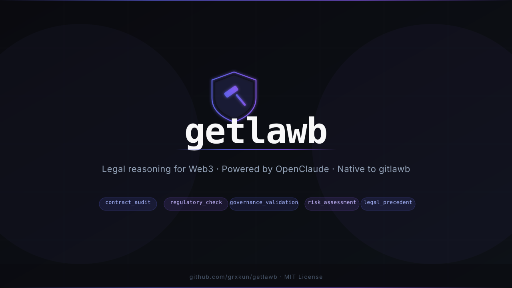

# getlawb

**Automated legal reasoning for Web3 — the legal front desk of the [gitlawb](https://gitlawb.com) ecosystem.**

[](https://github.com/grxkun/getlawb/actions/workflows/test.yml)
[](https://github.com/grxkun/getlawb/actions/workflows/security.yml)
[](https://www.npmjs.com/package/getlawb)
[](LICENSE)

---

## What is getlawb?

getlawb is a TypeScript SDK that brings automated legal analysis to Web3 development workflows. It routes queries to **OpenClaude** — the legal reasoning model — and returns structured, auditable findings on smart contracts, regulatory compliance, DAO governance, and risk exposure.

It operates natively on the [gitlawb](https://gitlawb.com) decentralized git network as a legal review agent: when a pull request is opened, getlawb automatically audits the code and posts findings directly on the PR.

```
Developer opens PR  →  getlawb detects .sol files  →  Legal analysis via OpenClaude
        ↓
Findings posted as PR review  →  APPROVE or REQUEST_CHANGES
```

---

## Install

```bash
npm install getlawb
```

---

## Quick Start

```typescript
import { GetlawbClient } from 'getlawb';

const client = new GetlawbClient(process.env.ANTHROPIC_API_KEY);

const result = await client.query({
  type: 'contract_audit',
  data: {
    code: `
      pragma solidity ^0.8.0;
      contract Token {
        mapping(address => uint256) public balances;
        function transfer(address to, uint256 amount) external {
          balances[msg.sender] -= amount;
          balances[to] += amount;
        }
      }
    `,
    language: 'solidity',
  },
});

console.log(result.risk_level);   // "HIGH"
console.log(result.findings);     // [{ type: "REGULATORY", severity: "HIGH", ... }]
console.log(result.audit_hash);   // SHA256 of findings for tamper detection
```

---

## Query Types

| Type | What it analyzes |
|------|-----------------|
| `contract_audit` | Solidity smart contracts — regulatory exposure, liability gaps, governance conflicts |
| `regulatory_check` | Token classifications, airdrop legality, securities law by jurisdiction |
| `governance_validation` | DAO proposals — conflicts, execution risk, token holder implications |
| `risk_assessment` | General legal risk, compliance gaps, mitigation strategies |
| `legal_precedent` | Relevant case law and regulatory decisions |
| `custom_query` | Any open-ended legal question with structured output |

---

## Response Format

Every response is deterministic and tamper-evident:

```typescript
{
  query_hash: "sha256 of input",       // deterministic cache key
  query_id: "uuid",
  query_type: "contract_audit",
  timestamp: 1716000000000,
  status: "success",
  risk_level: "HIGH",                  // LOW | MEDIUM | HIGH | CRITICAL
  confidence: 0.91,
  audit_hash: "sha256 of findings",   // verify with client.verifyAuditHash()
  findings: [
    {
      type: "REGULATORY",
      severity: "HIGH",
      description: "Token transfer may constitute unregistered securities offering.",
      remediation: "Consult securities counsel before mainnet deploy.",
      reference: "SEC v. W.J. Howey Co."
    }
  ],
  metadata: {
    tokens_used: 812,
    model: "claude-opus-4-7",
    latency_ms: 1340,
    cache_hit: false
  }
}
```

---

## Batch Queries

```typescript
const results = await client.queryBatch([
  { type: 'contract_audit', data: { code: contractA, language: 'solidity' } },
  { type: 'regulatory_check', data: { action: 'token airdrop' }, jurisdiction: 'US' },
  { type: 'risk_assessment', data: { entity: 'DAO treasury', context: 'multisig upgrade' } },
]);
```

---

## gitlawb Integration

getlawb runs as a legal review agent on the [gitlawb](https://gitlawb.com) decentralized git network. It automatically audits PRs and posts findings using Ed25519 HTTP Signatures (RFC 9421) — no API keys, no sessions.

### Setup

```bash
# Install gitlawb CLI
curl -fsSL https://gitlawb.com/install.sh | bash

# Create your agent identity
gl identity new
gl register
```

```typescript
import { GetlawbClient, GitlawbIntegration } from 'getlawb';

const client = new GetlawbClient(process.env.ANTHROPIC_API_KEY);
const integration = new GitlawbIntegration(client, {
  did: process.env.GITLAWB_DID,       // from: gl identity show
  keyPath: '~/.gitlawb/identity.pem',
});

// Watch a repo — auto-audit every new PR
const stop = await integration.watchRepo({
  owner: 'your-did',
  repo: 'your-repo',
  autoReview: true,
});
```

### Webhook Server

For continuous automated review, run the webhook server and point gitlawb at it:

```typescript
import { GetlawbClient, GitlawbIntegration, GitlawbWebhookServer } from 'getlawb';

const client = new GetlawbClient(process.env.ANTHROPIC_API_KEY);
const integration = new GitlawbIntegration(client, {
  did: process.env.GITLAWB_DID,
  keyPath: process.env.GITLAWB_KEY,
});

const server = new GitlawbWebhookServer(integration, {
  port: 3000,
  secret: process.env.WEBHOOK_SECRET,
});

await server.start();
```

Register the webhook:

```bash
gl webhook create your-repo \
  --url https://your-server.com \
  --events pull_request.opened \
  --secret your-secret
```

---

## Audit Hash Verification

Every response includes a `audit_hash` — a SHA256 of the findings. Use it to detect tampering:

```typescript
const isValid = client.verifyAuditHash(response);
// false if findings were modified after the fact
```

---

## Environment Variables

| Variable | Required | Description |
|----------|----------|-------------|
| `ANTHROPIC_API_KEY` | Yes | Your Anthropic API key |
| `GITLAWB_DID` | gitlawb only | Your agent DID from `gl identity show` |
| `GITLAWB_KEY` | gitlawb only | Path to Ed25519 key from `gl identity new` |
| `WEBHOOK_SECRET` | webhook only | HMAC secret for payload verification |

---

## Architecture

```
Your App
   │
   ▼
GetlawbClient
   │  query() — SHA256 cache key, deterministic
   │  verifyAuditHash() — tamper detection
   ▼
Anthropic API (OpenClaude)
   │  model: claude-opus-4-7
   │  temperature: 0.1 — deterministic output
   │  max_tokens: 4096
   ▼
Structured JSON findings

gitlawb Network
   │
   ▼
GitlawbIntegration
   │  Ed25519 HTTP Signatures (RFC 9421)
   │  DID-based identity — no API keys
   ▼
GitlawbWebhookServer
   │  HMAC-SHA256 payload verification
   │  auto PR review on pull_request.opened
   ▼
PR Review posted to gitlawb
```

---

## Development

```bash
git clone https://github.com/grxkun/getlawb
cd getlawb
npm install

npm run build   # TypeScript → dist/
npm test        # Jest test suite
npm run lint    # ESLint
```

---

## Contributing

PRs welcome. See [CONTRIBUTING.md](CONTRIBUTING.md).

Areas where help is needed:
- Python SDK
- Go SDK
- Hardhat plugin
- Foundry integration
- More query types

---

## License

MIT — see [LICENSE](LICENSE).

---

*getlawb is the legal front desk of the [gitlawb](https://gitlawb.com) ecosystem. It does not provide legal advice. Findings are for informational purposes and should be reviewed by qualified legal counsel.*
